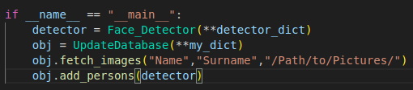
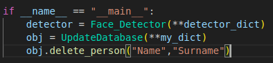
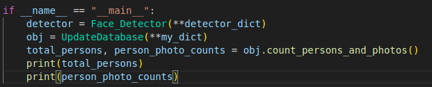

# Face Recognition System

This project is a face recognition system that performs tasks such as face detection, face recognition, and face tracking. The project uses various algorithms and models to detect, recognize, and track faces.

<p align="center">

<br>
<em>Face Recognition</em>
</p>


## Table of Contents

- [Project Structure](#Project-Structure)
- [How to use](#how-to-use)
  - [Create Environment and Install Packages](#create-environment-and-install-packages)
  - [Add new persons to datasets](#add-new-persons-to-datasets)
  - [Delete person from datasets](#Delete-person-from-datasets)
  - [View contacts saved in the datasets](#View-contacts-saved-in-the-datasets)
- [Technology](#technology)
  - [Face Detection](#face-detection)
  - [Face Recognition](#face-recognition)
  - [Face Tracking](#face-tracking)
  - [Matching Algorithm](#matching-algorithm)
- [Reference](#reference)

## Project Structure

The project has the following directory structure:

```
.
├── app
│   ├── config.py
│   ├── face_detection
│   │   ├── __init__.py
│   │   └── scrfd
│   │       ├── face_detector.py
│   │       └── weights
│   │           ├── README.md
│   ├── face_recognition
│   │   ├── arcface
│   │   │   ├── datasets
│   │   │   │   ├── backup
│   │   │   │   ├── data
│   │   │   │   ├── face_features
│   │   │   │   │   └── feature.npz
│   │   │   │   └── new_persons
│   │   │   ├── recognize.py
│   │   │   ├── rocognizer_utils.py
│   │   │   ├── update_database.py
│   │   │   └── weights
│   │   │       └── README.md
│   │   └── __init__.py
│   ├── face_tracking
│   │   ├── byte_tracker.py
│   │   ├── __init__.py
│   │   └── tracker_utils.py
│   └── __init__.py
├── app.py
├── configs
│   ├── config.local.toml
│   └── config.prod.toml
├── README.md
└── requirements.txt
```

## How to use

### Create Environment and Install Packages

If cuda is not installed on your computer
- [NVIDIA CUDA INTALLATION GUIDE](https://docs.nvidia.com/cuda/cuda-installation-guide-linux/index.html)

Check if Conda environment is installed
```bash
conda --version
```
if conda environment is not installed please do the necessary installations

- [Conda setup](https://conda.io/projects/conda/en/latest/user-guide/getting-started.html)

```bash
conda create -n face-dev python=3.9
```

```bash
conda activate face-dev
```

Please install the Torch library compatible with cuda on your system. In my case the following command works. Please do the necessary research from the related link (choose one of the them)
- [PyTorch Installation Guıde](https://pytorch.org/get-started/locally/)
```bash
pip install torch torchvision torchaudio --index-url https://download.pytorch.org/whl/cu124
```
if you don't have CUDA
```bash
pip install torch==1.9.1+cpu torchvision==0.10.1+cpu torchaudio==0.9.1 -f https://download.pytorch.org/whl/torch_stable.html
```

```bash
pip install -r requirements.txt
```
### Add new persons to datasets

```bash
cd app/face_recognition/arcface/
```
Check the code and the directory paths in the code please change Name Surname and Path that contain photographs
   <p align="center">
   
   <br>
   <em>Add Person</em>
   </p>

after the checks
```bash
python update_database.py
```

### Delete person from datasets
Change the update_database.py to:
   <p align="center">
   
   <br>
   <em>Delete Person</em>
   </p>

### View contacts saved in the datasets
Change the update_database.py to:
   <p align="center">
   
   <br>
   <em>Count Persons</em>
   </p>

To run the project you need to load data into the Dataset. For this you need to - [Add new persons to datasets](#Add-new-persons-to-datasets).
After that return to workplace
```bash
cd ../../..
```
Please make sure you are in the face_recognition directory!

### Config Files

The config.local.toml files contain configuration information such as model paths and 
detection/recognition/tracking parameters. Edit these files according to your needs:
(You can create similar configuration for production with necessary paths and parameters)

### Running the Application
For local environment:

```bash
python app.py --env local
```
For production environment:
```bash
python app.py --env prod
```

## Technology

### Face Detection

 **SCRFD**
   - SCRFD (Single-Shot Scale-Aware Face Detector) is designed for real-time face detection across various scales. It is particularly effective in detecting faces at different resolutions within the same image.

### Face Recognition

 **ArcFace**

   - ArcFace is a state-of-the-art face recognition algorithm that focuses on learning highly discriminative features for face verification and identification. It is known for its robustness to variations in lighting, pose, and facial expressions.


### Face Tracking

1. **ByteTrack**
   <p align="center">
   
   <br>
   <em>ByteTrack is a simple, fast and strong multi-object tracker.</em>
   </p>
