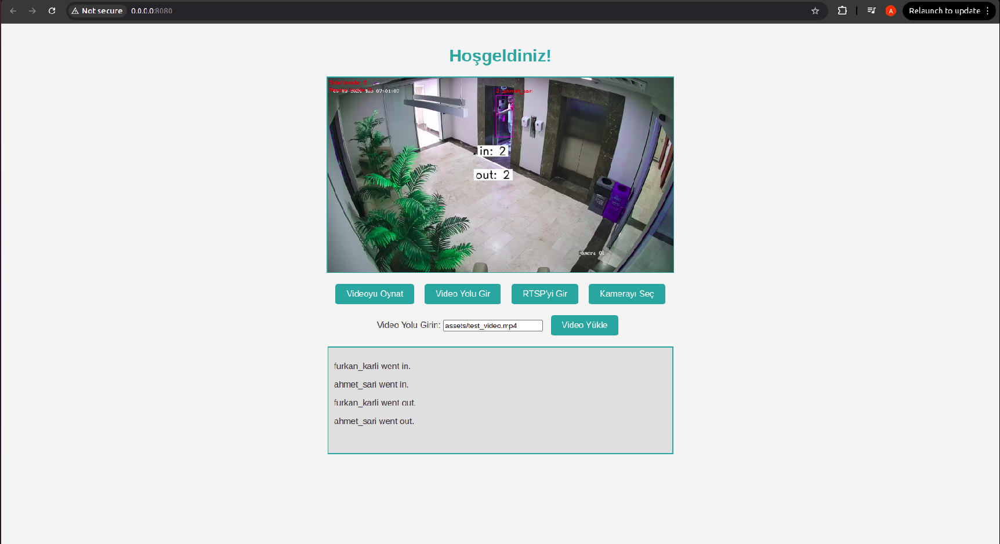
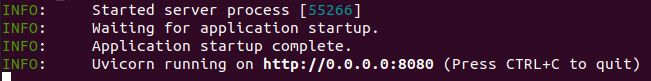
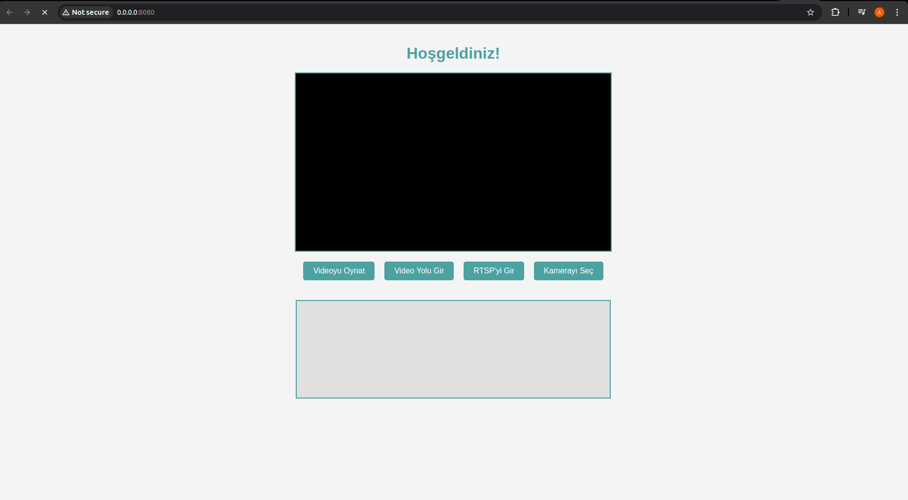
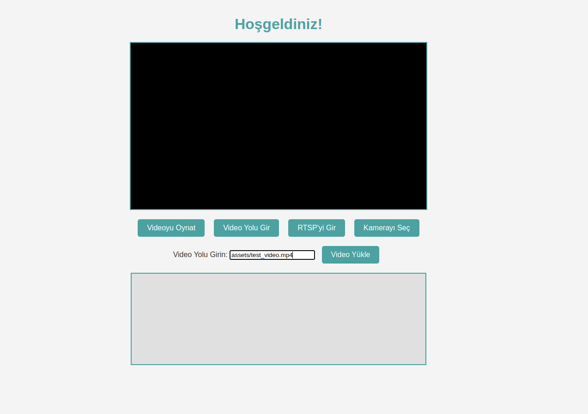
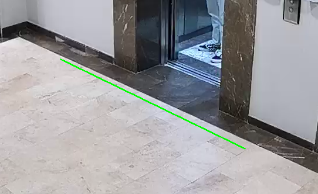

# Video Analysis System

This project is a face recognition system that performs tasks such as face detection, face recognition, and face tracking. The project uses various algorithms and models to detect, recognize, and track faces.

<p align="center">

<br>
</p>


## Table of Contents

- [Project Structure](#Project-Structure)
- [How to use](#how-to-use)
  - [Create Environment and Install Packages](#create-environment-and-install-packages)
  - [Running the application](#running-the-application)
- [Technology](#technology)
  - [Face Detection](#face-detection)
  - [Face Recognition](#face-recognition)
  - [Face Tracking](#face-tracking)
  - [Human Detection](#Human-Detection)
  - [Object Counter](#object-counter)
  - [Web Interface](#web-interface)

## Project Structure

The project has the following directory structure:

```
.
├── app
│   ├── config.py
│   ├── face_detection
│   │   ├── __init__.py
│   │   └── scrfd
│   │       ├── face_detector.py
│   │       └── weights
│   │           ├── README.md
│   ├── face_recognition
│   │   ├── arcface
│   │   │   ├── datasets
│   │   │   │   ├── backup
│   │   │   │   ├── data
│   │   │   │   ├── face_features
│   │   │   │   │   └── feature.npz
│   │   │   │   └── new_persons
│   │   │   ├── __init__.py
│   │   │   ├── recognize.py
│   │   │   ├── recognizer_utils.py
│   │   │   ├── update_database.py
│   │   │   └── weights
│   │   │       └── README.md
│   │   └── __init__.py
│   ├── face_tracking
│   │   ├── byte_tracker.py
│   │   ├── __init__.py
│   │   └── tracker_utils.py
│   ├── fps.py
│   ├── human_detection
│   │   ├── person_detection.py
│   │   └── weights
│   │       ├── README.md
│   ├── __init__.py
│   ├── logger.py
│   ├── person_counting
│   │   ├── __init__.py
│   │   ├── person_counter.py
│   │   └── utils.py
│   ├── streamer.py
│   ├── utils.py
│   └── web_interface
│       ├── FastAPI.py
│       ├── __init__.py
│       ├── static
│       │   └── style.css
│       └── templates
│           └── index.html
├── app.py
├── assets
│   ├── add_person.png
│   ├── bytetrack.png
│   ├── delete_person.png
│   ├── face_recognition.gif
│   ├── image.png
│   ├── list_people.png
├── configs
│   └── config.toml
├── logs
│   └── app.log
├── README.md
└── requirements.txt


```

## How to use

### Create Environment and Install Packages
check if you have cuda installed on your computer
```bash
nvcc --version
```

If cuda is not installed on your computer
- [NVIDIA CUDA INTALLATION GUIDE](https://docs.nvidia.com/cuda/cuda-installation-guide-linux/index.html)

Check if Conda environment is installed
```bash
conda --version
```
if conda environment is not installed please do the necessary installations

- [Conda setup](https://conda.io/projects/conda/en/latest/user-guide/getting-started.html)

```bash
conda create -n face-dev python=3.9
```

```bash
conda activate face-dev
```

create new package
```bash
mkdir ~/workplace
cd ~/workplace
git clone https://github.com/AhmetNeoSari/face_recognition.git
cd face_recognition
```

if you don't have gpu use "onnxruntime==1.18.1" instead "onnxruntime-gpu==1.18.1" in requirements.txt

```bash
pip install -r requirements.txt
```
## Install weights for detection and recognition
to install detection model weight go to weights directory
```bash
cd ~/workplace/face_recognition/app/face_detection/scrfd/weights
```
and from the url in readme.md install scrfd_2.5g_bnkps.onnx file
- [link](https://drive.google.com/drive/folders/1C9RzReAihJQRl8EJOX6vQj7qbHBPmzME?usp=sharing)

to install recognition model weight go to weights directory
```bash
cd ~/workplace/face_recognition/app/face_recognition/arcface/weights/ 
```

Download arcface_r100.pth at the link
- [link](https://drive.google.com/drive/folders/1CHHb_7wbvfjKPFNKVBb76lL5sVfBLcv5?usp=sharing)

to install YOLO weight for human detection navigate the path
```bash
cd ~/workplace/face_recognition/app/human_detection/weights
```
and download the yolo model with the relevant link
- [link](https://docs.ultralytics.com/models/yolov10/#model-variants)

To run the project you need to load data into the Dataset. For this you need to add at least one person to dataset
```bash
cd ~/workplace/face_recognition/
```
Please make sure you are in the face_recognition(root) directory!

### Config Files

The config.toml where is configs/config.toml files contain configuration information such as model paths and 
detection/recognition/tracking parameters. Edit these files according to your needs.

### Running the Application
Firstly, add user to system:
```bash
cd ~/workplace/face_recognition/app/face_recognition/arcface/update_database.py
```
Use the ```fetch_images``` function to get user photos and use ```add_persons``` function to add persons to system. The folder name must name_surname, the folder contains photos of user
```python
obj.fetch_images("~/Pictures/Webcam/name_surname")
obj.add_persons(detector=detector)
```
After add user to system. Ready to start.

```bash
cd ~/workplace/face_recognition/
python app.py
```
If you want to find out what the fps is, you can print it to the log file by starting it as follows:
```bash
cd ~/workplace/face_recognition/
python app.py --fps
```
if you want to view the output you can run it as follows:
```bash
python app.py --show
```
   <p align="center">
   
   <br>
   </p>

navigate port(8080): 
- [web interface ](http://0.0.0.0:8080)

choose one of the **Video Yolu Gir**, **RTSP'yi Gir**, **Kamerayı Seç** buttons and press to the button.
   <p align="center">
   
   <br>
   </p>

After entering the video path, press the ‘Video Yükle’ button and then the ‘Video Oynat’ button. (Enter a number such as 0, 1, 2 for the Select camera button. 0 for Webcam)
   <p align="center">
   
   <br>
   </p>
Draw the region to be analysed in the first frame after pressing the "Video Oynat" button. Then, press "q".
   <p align="center">
   
   <br>
   <em></em>
   </p>

The analysis will start on the web page
## Technology

### Face Detection

 **SCRFD**
   - SCRFD (Single-Shot Scale-Aware Face Detector) is designed for real-time face detection across various scales. It is particularly effective in detecting faces at different resolutions within the same image.

### Face Recognition

 **ArcFace**

   - ArcFace is a state-of-the-art face recognition algorithm that focuses on learning highly discriminative features for face verification and identification. It is known for its robustness to variations in lighting, pose, and facial expressions.


### Person Tracking

 **ByteTrack**
   <p align="center">
   
   <br>
   <em>ByteTrack is a simple, fast and strong multi-object tracker.</em>
   </p>

### Human Detection
  **YOLO**
    - is a popular and efficient object detection algorithm that divides the input image into a grid and predicts bounding boxes and class probabilities directly. It allows for real-time object detection and is known for its speed and accuracy.
    In this project, YOLO is utilized for detecting humans in the video stream to assist with people counting and tracking. The algorithm can quickly identify individuals within a frame, making it suitable for real-time applications.

### Object Counter
  **Supervision**
   is a framework designed to monitor and count objects in specified regions within a video or image stream. It can be used to track the number of people entering or exiting an area, providing real-time analytics for people counting.
   In this project, Supervision is used to count the number of people detected and tracked across defined regions, making it suitable for various applications such as crowd monitoring, entrance management, and area surveillance. 
  
### Web Interface
  **FastAPI**
     is a modern, fast (high-performance) web framework for building APIs with Python. It is based on standard Python type hints, making it easy to define request and response models.
